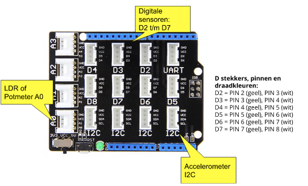
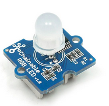

## :rocket: Introductie
Na het installeren van Arduino en het aansluiten van de hardware kun je op deze plek voorbeelden vinden van kant en klare code. Hierboven zie je twee verschillende setjes code: "Basics-components" en "Basics-interactions". Onder Basics-interactions staat voorbeeldcode waarbij combinaties zijn gemaakt tussen sensoren en actuatoren (output). Wil je een andere sensor gebruiken of meersere soorten output aan een sensor hangen? Dan kun je code gebruiken uit 'basics-components'. In de code voorbeelden staat ook hoe je de sensoren en actuatoren (output) kunt aansluiten. Wil je een sensor herkennen? Dan kun je hieronder een verwijzing vinden met het overzicht van alle sensoren.

### :hamburger: Installeren Arduino IDE 

[Deze video](https://youtu.be/mFxqtiRe4xE) doorloopt onderstaande stappen.

1. Download [Arduino IDE](https://www.arduino.cc/en/software)
2. Sleep deze naar de map 'Applications'
3. Sluit je Arduino UNO aan (via USB)
4. Open de Arduino IDE
5. Stel de Arduino IDE in op Engels (via menu "Preferences")
6. Selecteer Arduino UNO en de poort (/dev/cu.usbmodem ****)
6. Open File > Examples > 01.Basics > Blink
7. Upload deze file naar je Arduino UNO (command + U)
8. Kijk of je een lampje ziet knipperen (tussen de boards van je UNO, 1 seconde aan/1 seconde uit
9. Pas de getallen aan in de code (nu 500 ipv 1000 milliseconden)
10. Upload de code en zie het verschil in knipperen

Werkt het? :trophy: :trophy: :trophy:
Werkt het niet? Beschrijf dan goed (maak screenshots) wat er niet lukt, dit lever je dan in bij ToDo1

Windows only: soms moet je dialogen goedkeuren. Is je board niet herkend? kijk dan naar https://electronics-project-hub.com/arduino-not-detected-and-driver-issues-solved/ 

### :books: Installeren van libraries
Sommige sensoren of actuatoren gebruiken libraries om de code eenvoudiger leesbaar te houden. Als dit nodig is staat dat in de voorbeeldcode. 

1. Open de tab Libraries: 'Tools > Manage Libraries…'
2. Zoek naar de juiste library
3. Klik “install” (voor onze projecten is de versie niet van groot belang)

### :eyes: Sensoren

| naam | Sensor   | functie   |
| :---:   | :---: | :---: |
| Afstand sensor|   | Deze afstandsmeting stuurt een een ultrasoon geluidssignaal uit en ontvangt deze als het geluid weerkaatst is. De tijd tussen versturen en ontvangen is afhankelijk van de afgelegde weg van het geluidssignaal. Zo wordt de afstand tot het object berekend. Deze sensor zit ook in auto’s als parkeersensor. |
| Led Strip |    | Elke led kan je individueel aansturen in alle RGB kleuren. Er zit een plakrand aan zodat je hem makkelijk kunt verwerken in je project (dus beschadigen). Gebruik je deze plakrand of verwerkt je hem in je project? Dat geen probleem maar je moet hem dan kopen (5 euro per strip). Dan kunnen we nieuwe kopen voor de aankomende studenten |
| Lichtsensor |  | De Grove - lichtsensor heeft een analoge output. Hoe feller het licht is, des te hoger de waarde. Je sluit de lichtsensor aan op het A0 stekkertje. |
| Temp. en vocht |    | Deze meet de temperatuur van de lucht en de hoeveelheid vocht in de lucht. Test en demo de werking met blazen in de sensor, liever niet met een aansteker ;-)  |
| Blauwe LED en Drukknop |     | Dit component bevat een LED lampje en een drukknop. Deze kun je onafhankelijk van elkaar aansturen of uitlezen.   |
| Accelerometer - Bewegingsmeter 1.5g |   | LET OP! Zoek bij deze sensor de 1.5g code. Dit is een sensor die beweging en stand weergeeft over drie assen (x, y en z). Een soortgelijke sensor zit ook in je telefoon. Je kunt ‘m ook programmeren om gebaren en bewegingen te herkennen, of te herkennen als er op getikt wordt.
| Accelerometer - Bewegingsmeter 16g |   | LET OP!  Zoek bij deze sensor de 16g code. Dit is een sensor die beweging en stand weergeeft over drie assen (x, y en z). Een soortgelijke sensor zit ook in je telefoon. Je kunt ‘m ook programmeren om gebaren en bewegingen te herkennen, of te herkennen als er op getikt wordt.
| Servo |  | De as van dit ‘motortje’ kan draaien over 180 graden en in elke gewenste positie worden geplaatst. Je kunt ook beweging prototypen door de motor heen en weer te laten draaien. Tip: draai de servo niet helemaal in zijn uiterste van het bereik om te voorkomen dat deze gaat trillen.   |
| Trilmotor |  | Deze vibratiemotor (ook wel haptic motor) wordt gebruikt in smartphones en wearables. Je kunt hiermee informatie voelbaar doorgeven. Je kunt hier ook hoorbare feedback mee maken, door het motortje tegen hard materiaal te laten trillen. Hang je hem bijvoorbeeld tegen een glas, dan heb je een bel.|
| Chainable LED |  | Dit component bevat een RGB LED. Je kunt de kleur en de helderheid instellen. In een aantal gevallen is de Ledstrip een makkelijkere keuze. De RGB led is wel fijn om in te bouwen in je prototype. Je kunt deze led doorverbinden, dus als je 4 leds wilt hebben, dan maak je een ketting (OUT naar IN). Vandaar de naam Chainable led.|

### :anger: Fouten oplossen
Check **altijd eerst** of het een code of hardware probleem is:

1. Selecteer de Uno en de Port (”/dev/cu.usbserial**’MAC of com Windows)
3. Open een lege sketch (File > New of druk 'command + n') 
4. Upload deze lege sketch (of 'command + u')

**Lukt het uploaden van een lege sketch?** Dan zijn de foutmeldingen veroorzaakt door een probleem in je code. In de slides van Les 2 staan de fouten en de oplossing beschreven. Globaal kun je deze stappen doorlopen:

1. Ga terug naar een versie die wel werkte
2. Kijk naar de foutmelding (letterlijke tekst)
3. Kijk waar de fout ontstaat (roze balk)

**Code uploaden lukt niet**

1. Staat je Port er niet bij? Ruil dan je hardware (en kabel) even met je Buur
2. Je kunt ook proberen de Arduino opnieuw aan je Laptop aan te sluiten (als je geen buur hebt)
3. Kijk nogmaals naar [https://youtu.be/C6NZ1WOGFKw]() 
